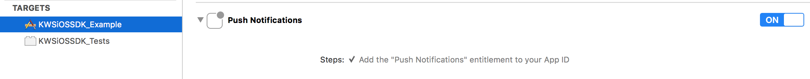
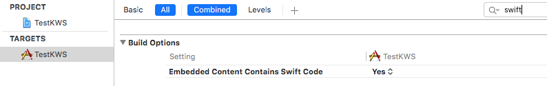

Integrate the SDK
=================

Prerequisites
^^^^^^^^^^^^^

Before using the KWS iOS SDK to manage remote notifications, it's important you setup your application to support
push notifications:

It's also important, if you're working in an Objective-C environment, to specify the following parameter in the **Build Settings**
panel of your project:

This is because the SDK is written in **Swift**.

Install
^^^^^^^

The iOS SDK can be installed via `CocoaPods <http://cocoapods.org/>`_:

You'll need to modify your **Podfile** to add it:

.. code-block:: shell

    use_frameworks!

    target 'MyProject' do
        pod 'KWSiOSSDK'
    end

Import
^^^^^^

The SDK is build to work with either a purely Swift project or a mix of Swift and Objective-C.

To import it in a Swift Project just add the following line to the top of your .swift file:

.. code-block:: swift

    import KWSiOSSDK

Similarly, in an Objective-C file, you'll need to add the following line:

.. code-block:: obj-c

    @import KWSiOSSDL
    // or
    // #import <KWSiOSSDK/KWSiOSSDK-Swift.h>
