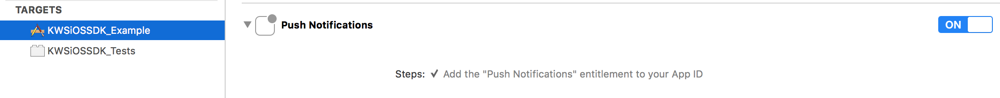

Integrate the SDK
=================

Prerequisites
^^^^^^^^^^^^^

Before using the KWS iOS SDK to manage remote notifications, it's important you setup your application to support
push notifications:

Install
^^^^^^^

The iOS SDK can be installed via `CocoaPods <http://cocoapods.org/>`_:

You'll need to modify your **Podfile** to add it:

.. code-block:: shell

    target 'MyProject' do
        pod 'KWSiOSSDKObjC'
    end

Import
^^^^^^

To import the relevant SDK header:

.. code-block:: obj-c

    #import "KWS.h"
