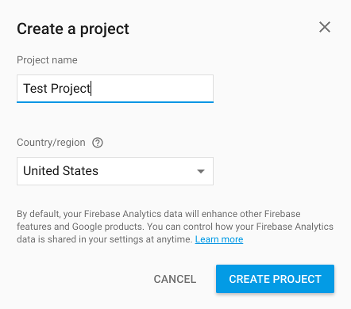
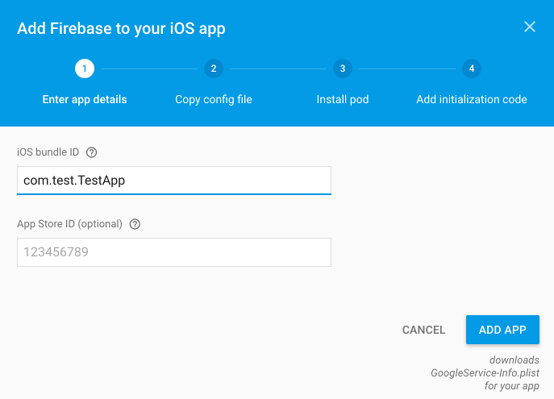
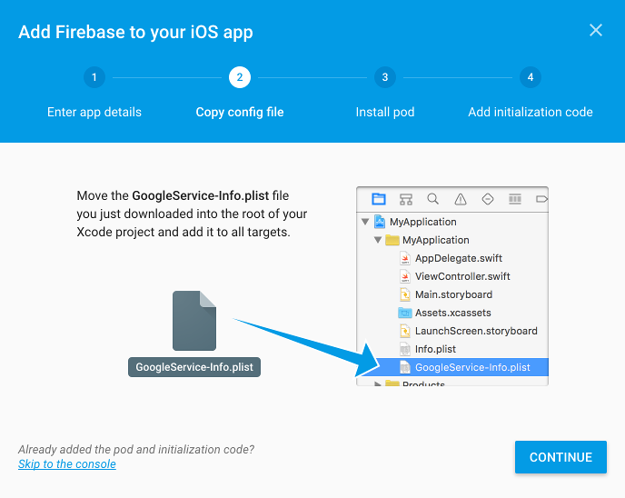
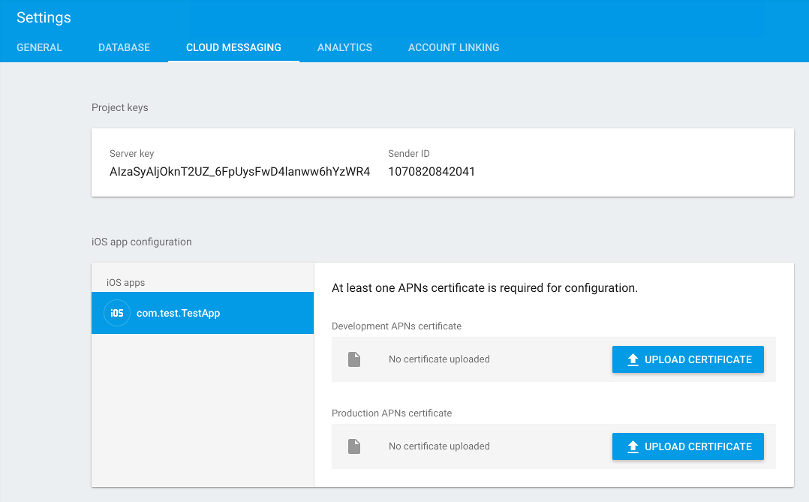

Firebase
========

To handle Remote Notifications, Kids Web Services uses the Google service called `Firebase <https://firebase.google.com/>`_.

To be able to properly integrate it you'll have to setup a new Project `Firebase Console <https://console.firebase.google.com/>`_.

Then you'll have to add a new iOS Project:

This will generate a new **GoogleService-Info.plist** file that you'll have to add to your XCode project root.

Finally you'll have to add two new **Pods** to your original **Podfile**:

.. code-block:: shell

  target 'MyProject' do
    pod 'KWSiOSSDKObjC', '<sdk_version>'
    pod 'Firebase', '3.7.1'
    pod 'FirebaseMesssagine', '1.2.0'
  end

Finally in the **Settings** section of the App you just created in Firebase you'll have to add development and production APNS certificates:

Once these steps are completed successfully you can go to the next section to see how to work with Remote Notifications through Kids Web Services.

.. note::

  You can find more information about Firebase `here <https://firebase.google.com/docs//>`_.
