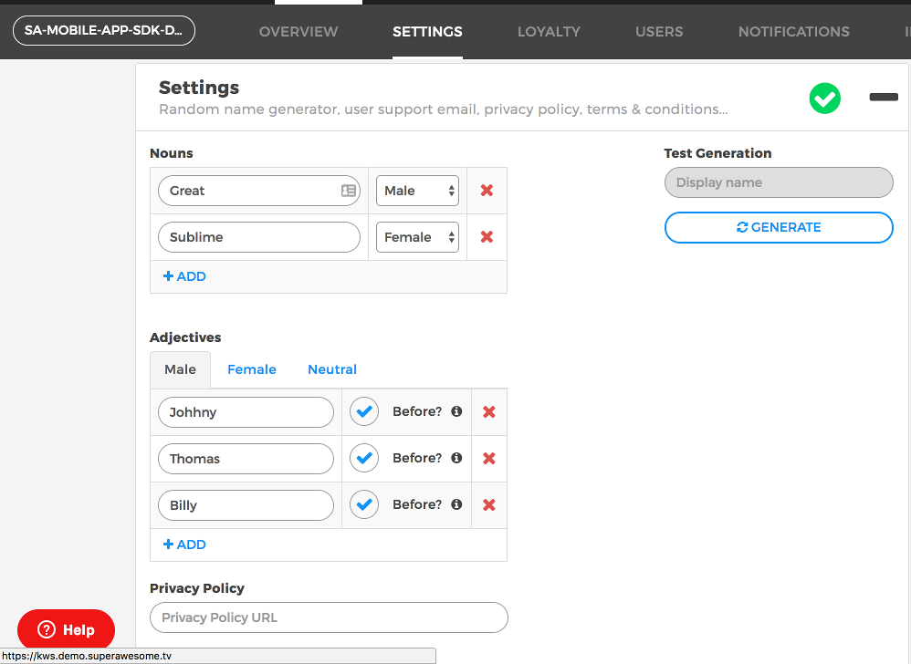

Obtaining a random display name
===========================

Sometimes it's a good idea to preemptively suggest a display name to users who want to create a new account.
Whether you want to ensure display names are valid, safe and non-duplicate or you wish to align names with the
in game universe you have created, KWS can help you by providing a method to generate random display names.

In order for KWS to properly generate then you'll first have to add possible values in your KWS dashboard:

Once that's done, it's a simple as calling:

.. code-block:: objective-c

  [[KWSChildren sdk] getRandomUsername: ^(NSString *name) {
      // if the name parameter is null, no name could be generated or
      // KWS is down;
      // Otherwise it will return a valid, unique name based on the values
      // you entered in the dashboard
  }];
