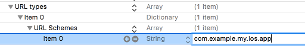

Authenticating a user
=====================

To be able to authenticated (login or create) a user through the OAuth Implicit flow you must follow the next steps:

Enable Implicit Flow in the Control Panel
-----------------------------------------

The first step is to enable Implicit Flow in your Kids Web Services Control Panel.

- Head over to the **Integration** section of your app
- Under the **User Authentication (Single Sign On)** section enable **Implicit Flow**

.. image:: img/oauth_1.png

.. note:: Please take a note of the **SSO (Single Sign On) URL** because you will need it later.

Add OAuth redirect URLs
-----------------------

The second step, once you've enabled Implicit Flow, is to add **OAuth Redirect URLs** to the Control Panel.

.. image:: img/oauth_2.png

Where **com.example.my.ios.app** is the Bundle Id of your iOS app.

Modify your Plist file
----------------------

The third step is to add the following keys to your Plist file:

This will allow your app to recognise and open certain URL schemes. In this case add your Bundle Id (com.example.my.ios.app) as the
desired URL scheme.

Modify your App Delegate
------------------------

The fourth step is to add the following method in your AppDelegate.h file:

.. code-block:: objective-c

    #import "KWSChildren.h"

    // ..

    - (BOOL)application:(UIApplication *)app openURL:(NSURL *)url options:(NSDictionary<UIApplicationOpenURLOptionsKey, id> *)options {

      [[KWSChildren sdk] openUrl:url withOptions:options];

      return true;
    }

This will allow your iOS app to receive and parse the response back from the authentication process.

Call authentication method
--------------------------

Finally, once the prerequisite steps have been completed you can call the SDK method that will initialise the authentication process.

To do so we'll use the **SSO (Single Sign On) URL** obtained from the Kids Web Services Control Panel earlier on.

For our example, that should be something like **https://my.cluser.accounts.kws.superawesome.tv/**.

.. code-block:: objective-c

    // this function takes the SSO URL as the first parameter
    // and a View Controller instance as the second parameter
    // as well as a callback listener as the third parameter
    [[KWSChildren sdk] authWithSingleSignOnUrl:@"https://my.cluser.accounts.kws.superawesome.tv/"
                                    fromParent:self
                                   andResponse: ^(KWSChildrenLoginUserStatus status)
    {
      // handle the auth response status
      switch (status) {
        case KWSChildren_LoginUser_Success:
          // authenticated OK
          break;
        case KWSChildren_LoginUser_InvalidCredentials:
          // one of the credentials was not valid
          break;
        case KWSChildren_LoginUser_NetworkError:
          // there was a network error
          break;
      }
    }];

The callback will pass the following values on completion:

====== ========================== ======
Value  Type                       Meaning
====== ========================== ======
status KWSChildrenLoginUserStatus End status of the operation
====== ========================== ======

The **status** parameter may have the following values:

======================================== ======
Value                                    Meaning
======================================== ======
KWSChildren_LoginUser_Success            User was authenticated successfully
KWSChildren_LoginUser_InvalidCredentials The username or password were incorrect
KWSChildren_LoginUser_NetworkError       Other network error
======================================== ======
