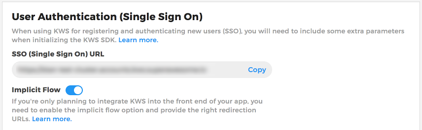

Creating and authenticating a user
==================================

There are two ways of creating or authenticating a user: using a KWS brandable view or using your own Native view.

KWS brandable view
^^^^^^^^^^^^^^^^^^

To be able to authenticate or create a user through a KWS brandable view you must follow the next steps:

Enable Implicit Flow in the Control Panel
-----------------------------------------

The first step is to enable Implicit Flow in your Kids Web Services Control Panel.

- Head over to the **Integration** section of your app
- Under the **User Authentication (Single Sign On)** section enable **Implicit Flow**

.. note:: Please take a note of the **SSO (Single Sign On) URL** because you will need it later.

Add OAuth redirect URLs
-----------------------

The second step, once you've enabled Implicit Flow, is to add **OAuth Redirect URLs** to the Control Panel.

.. image:: img/oauth_2.png

Where **com.example.my.ios.app** is the Bundle Id of your iOS app.

Modify your Plist file
----------------------

The third step is to add the following keys to your Plist file:

.. image:: img/oauth_3.png

This will allow your app to recognise and open certain URL schemes. In this case add your Bundle Id (com.example.my.ios.app) as the
desired URL scheme.

Modify your App Delegate
------------------------

The fourth step is to add the following method in your AppDelegate.h file:

.. code-block:: objective-c

    #import "KWSChildren.h"

    // ..

    - (BOOL)application:(UIApplication *)app openURL:(NSURL *)url options:(NSDictionary<UIApplicationOpenURLOptionsKey, id> *)options {

      [[KWSChildren sdk] openUrl:url withOptions:options];

      return true;
    }

This will allow your iOS app to receive and parse the response back from the authentication process.

Call authentication method
--------------------------

Finally, once the prerequisite steps have been completed you can call the SDK method that will initialise the authentication process.

To do so we'll use the **SSO (Single Sign On) URL** obtained from the Kids Web Services Control Panel earlier on.

For our example, that should be something like **https://my.cluster.accounts.kws.superawesome.tv/**.

.. code-block:: objective-c

    // this function takes the SSO URL as the first parameter
    // and a View Controller instance as the second parameter
    // as well as a callback listener as the third parameter
    [[KWSChildren sdk] authWithSingleSignOnUrl:@"https://my.cluster.accounts.kws.superawesome.tv/"
                                    fromParent:self
                                   andResponse: ^(KWSChildrenLoginUserStatus status)
    {
      // handle the auth response status
      switch (status) {
        case KWSChildren_LoginUser_Success:
          // authenticated OK
          break;
        case KWSChildren_LoginUser_InvalidCredentials:
          // one of the credentials was not valid
          break;
        case KWSChildren_LoginUser_NetworkError:
          // there was a network error
          break;
      }
    }];

The callback will pass the following values on completion:

====== ========================== ======
Value  Type                       Meaning
====== ========================== ======
status KWSChildrenLoginUserStatus End status of the operation
====== ========================== ======

The **status** parameter may have the following values:

======================================== ======
Value                                    Meaning
======================================== ======
KWSChildren_LoginUser_Success            User was authenticated successfully
KWSChildren_LoginUser_InvalidCredentials The username or password were incorrect
KWSChildren_LoginUser_NetworkError       Other network error
======================================== ======

Native view
^^^^^^^^^^^

To be able to authenticate and create a user using your own native views, you can use the following methods:

Creating a user
---------------

If there are no valid users, you can create a new one by calling:

.. code-block:: objective-c

  [[KWSChildren sdk] createUser: @"username"
                   withPassword: @"password"
                 andDateOfBirth: @"2011-03-02"
                     andCountry: @"US"
                 andParentEmail: @"parent@test.com"
                    andResponse: ^(KWSChildrenCreateUserStatus status)
  {
    switch (status) {
      case KWSChildren_CreateUser_Success: {
        // create new user OK
        break;
      }
      case KWSChildren_CreateUser_NetworkError: {
        // network error while creating user
        break;
      }
      case KWSChildren_CreateUser_DuplicateUsername: {
        // duplicate username
        break;
      }
    }
  }];

The callback will pass the following values on completion:

======= =========================== ======
Value   Type                        Meaning
======= =========================== ======
status  KWSChildrenCreateUserStatus End status of the operation
======= =========================== ======

The **status** parameter may have the following values:

========================================= ======
Value                                     Meaning
========================================= ======
KWSChildren_CreateUser_Success            User was authenticated successfully
KWSChildren_CreateUser_InvalidUsername    Chosen username contains invalid characters
KWSChildren_CreateUser_InvalidPassword    Password is less than 8 characters
KWSChildren_CreateUser_InvalidDateOfBirth Date should have YYYY-MM-DD format
KWSChildren_CreateUser_InvalidCountry     Country should have CC format
KWSChildren_CreateUser_InvalidParentEmail Parent email is invalid
KWSChildren_CreateUser_DuplicateUsername  The username is already in use
KWSChildren_CreateUser_NetworkError       Other network error
KWSChildren_CreateUser_InvalidOperation   Other invalid operation
========================================= ======

From here on you'll be able to check leaderboards, assign points, enable remote notifications, set app data, etc.

Obtaining a random display name
-------------------------------

Sometimes it's a good idea to preemptively suggest a display name to users who want to create a new account.
Whether you want to ensure display names are valid, safe and non-duplicate or you wish to align names with the
in game universe you have created, KWS can help you by providing a method to generate random display names.

In order for KWS to properly generate then you'll first have to add possible values in your KWS dashboard:

.. image:: img/randomnames.png

Once that's done, it's a simple as calling:

.. code-block:: objective-c

  [[KWSChildren sdk] getRandomUsername: ^(NSString *name) {
      // if the name parameter is null, no name could be generated or
      // KWS is down;
      // Otherwise it will return a valid, unique name based on the values
      // you entered in the dashboard
  }];

Login user
----------

To login as a user you'll have to call:

.. code-block:: objective-c

  [[KWSChildren sdk] loginUser: @"username"
                  withPassword: @"password"
                   andResponse: ^(KWSChildrenLoginUserStatus status)
  {
    // handle the auth response status
    switch (status) {
      case KWSChildren_LoginUser_Success:
        // authenticated OK
        break;
      case KWSChildren_LoginUser_InvalidCredentials:
        // one of the credentials was not valid
        break;
      case KWSChildren_LoginUser_NetworkError:
        // there was a network error
        break;
    }
  }];

The callback will pass the following values on completion:

====== ========================== ======
Value  Type                       Meaning
====== ========================== ======
status KWSChildrenLoginUserStatus End status of the operation
====== ========================== ======

The **status** parameter may have the following values:

======================================== ======
Value                                    Meaning
======================================== ======
KWSChildren_LoginUser_Success            User was authenticated successfully
KWSChildren_LoginUser_InvalidCredentials The username or password were incorrect
KWSChildren_LoginUser_NetworkError       Other network error
======================================== ======
