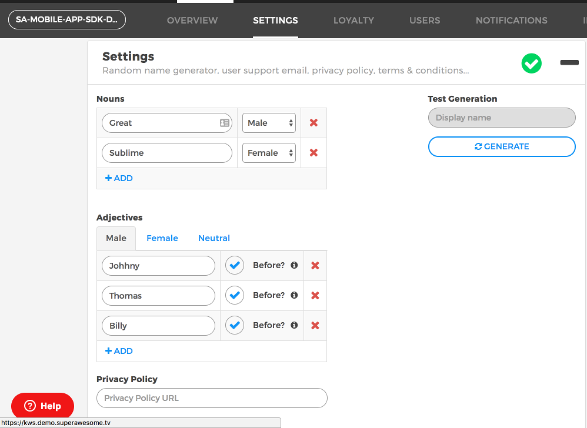

Random Display Name
==================================

Sometimes it's a good idea to preemptively suggest a display name to users who want to create a new account.
Whether you want to ensure display names are valid, safe and non-duplicate or you wish to align names with the
in game universe you have created, KWS can help you by providing a method to generate random display names.

How to get a random display name
--------------------------------

In order for KWS to properly generate then you'll first have to add possible values in your KWS dashboard:

Once that's done, it's a simple as using the **interface service** named **IUsernameService** and the method to call is:
  
  * **getRandomUsername**

As such:

.. code-block:: java

  //myEnvironment is considered to be a valid environment 

  val sdk = ComplianceSDK(myEnvironment)
  val usernameService = sdk.getService(IUsernameService::class.java)

  usernameService?.getRandomUsername { username, error ->

    if (username != null) {
      //Success! We have a valid username
    } else {
      //Uh-oh! It seems there's an error...
    }
  }

The callback will pass the following values on completion:

============== ====================== ========
Value           Type                  Meaning
============== ====================== ========
username        IRandomUsernameModel  If non-null, SDK was able to get a random username as per rules defined in KWS dashboard
error           Throwable             If non-null, an error occurred
============== ====================== ========

The **IRandomUsernameModel** parameter will have the following values:

============== ======== ========
Field           Type    Meaning
============== ======== ========
randomUsername String   The username generated
============== ======== ========
