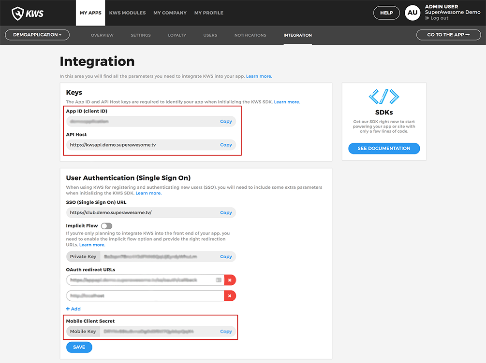

Initialise the SDK
==================

Environment
^^^^^^^^^^^

As mentioned before, in order to be able to use the Kids Web Services SDK, there's the need of an **environment** and a **service protocol**.

Your custom environment 
-----------------------

For the **environment**, you'll first have to initialise it with the following values:

	* API Host - to be used as **domain**
	* App ID (client ID) - to be used as **clientID**
	* Mobile Client Secret - to be used as **clientSecret**

You can obtain these credentials from the **Integration** section of your Kids Web Services Control Panel:

They should be different for each app you have.

.. note::

	For the sake of this example, the values considered will be:

	* **domain** - "https://kwsapi.demo.superawesome.tv/"
	* **clientID** - "client_id"
	* **clientSecret** - "client_secret"

Assuming these config values, you should create a data class environment that extends from the Compliance SDK's **ComplianceNetworkEnvironment**. 

Our suggestion of an implementation is as follows:

.. code-block:: swift

	public class MyEnvironment: ComplianceNetworkEnvironment {

		public var domain: String = "https://kwsapi.demo.superawesome.tv/"
		public var clientID: String = "client_id"
		public var clientSecret: String = "client_secret"
	}

Service Protocols
^^^^^^^^^^^^^^^^^

Having a generic environment for the Kids Web Service SDK, it's time to understand how to use the **service protocols** in your app.

The **service protocols** will provide visibility to the SDK, displaying the available functionalities. 

This is a list of the available **interface services**:

* **SingleSignOnServiceProtocol** - Web Auth flow
* **AuthServiceProtocol** - in app authentication
* **UsernameServiceProtocol** - username details
* **UserServiceProtocol** - user details
* **UserActionsServiceProtocol** - user related actions
* **ScoreServiceProtocol** - scoring details
* **SessionServiceProtocol** - user session local cache

.. note::
	More information regarding each functionality is available in the specific page that it relates to.

Using the KWS SDK 
^^^^^^^^^^^^^^^^^

Then, as seen before, the pattern to follow is:

.. code-block:: swift

  var myEnvironment : MyEnvironment() //your environment
  let sdk = ComplianceSDK(withEnvironment: myEnvironment!) //initialize the ComplianceSDK
  let myService = sdk.getService(withType: MyServiceProtocol.self) //get the 'ServiceProtocol' with desired functionalities

  myService?.methodCall()

The next order of business is understanding the types of callback we can get when using the SDK.
