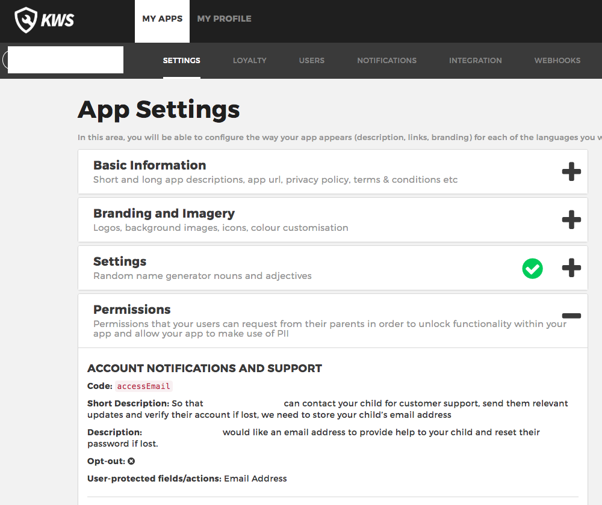

Request permissions
===================

If for any reason your app needs access to specific user information, like first name, last name, email address or physical address you'll first have
to ask permission for it. Kids Web Services will handle sending an explanatory email to the user's parent. From then on the parent will be able to
access the Parent Portal to manage these permissions.

To request permission for the user you're authenticated as, you'll have to use the **service protocol** named **UserActionsServiceProtocol** and the method to call is:

  * **requestPermissions**

And it will take:

============ ============ ========
Field        Type          Meaning
============ ============ ========
permissions  [String]     The list of permissions to request
userId       Integer      The current authenticated user id 
token        String       The current authenticated user token 
============ ============ ========

.. note::
  The permissions you can request can be checked on the Control Panel

In this example we'll be requesting the permissions for 'accessEmail' and a code snippet of this functionality usage is:

.. code-block:: swift

  let myEnvironment = MyEnvironment()
  let sdk = ComplianceSDK(withEnvironment: myEnvironment!)
  let userActionsService = sdk.getService(withType: UserActionsServiceProtocol.self)

  let permissions : [String] = ["accessEmail"]

  userActionsService?.requestPermissions(permissions: permissions, userId: 123, token: "AAA.BBB.CCC") { (error) in
    if error == nil {
        //Success!!! All went well.
      } else {
        //Uh-oh! It seems there's an error...
      }
  }

The callback will pass the following values on completion:

======= ========= ======
Value   Type      Meaning
======= ========= ======
error   Error     If non-null, an error occurred
======= ========= ======

.. note::

  Normally just by requesting a permission you won't automatically get access to request or modify the associated bit of information. You'll have to await the parent's decision. 

  You can always check the status in the **UserDetailsModelProtocol** protocol, under **PermissionsModelProtocols**.

.. note::

  If the callback **requested** parameter is **false** then it means the user doesn't yet have an associated parent email. This is common for new users. Check out the next section to find out how to request and submit the parent email.
