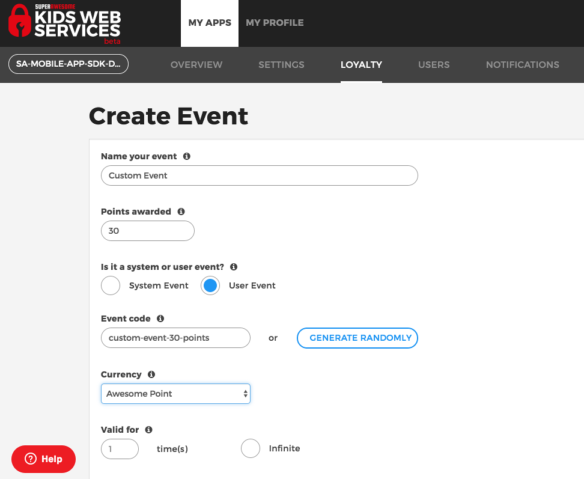

Events
======

Kids Web Services allows you to define custom events in the Control Panel through which you can add or subtract points for users.

Events are defined on a per-app basis.

After creating an event, it should look like this:

Trigger event
-------------

You can trigger an event for the user you're authenticated as by using **IUserActionsService** and calling:

* **triggerEvent**

It will take:

=========== ======= =======
Field       Type    Meaning
=========== ======= =======
eventId     String  The event id, as defined in the Control Panel
points      Integer The number of points to be awarded
userdId     Integer The authenticated user id
token       String  The authenticated user token
=========== ======= =======

.. note::

	Please note that this **eventId** is the **event code**. 

	From the example image, it will be **custom-event-30-points**.

And look like this:

.. code-block:: java

   //myEnvironment is considered to be a valid environment 

   val sdk = ComplianceSDK(myEnvironment)
   val userActionsService = sdk.getService(IUserActionsService::class.java)

   //your event code as per the Control Panel
   val eventId = "custom-event-30-points"
   
   //the number of points to award
   val points = 30

   userActionsService?.triggerEvent(eventId = eventId, points = points, userId = 123, token = "AAA.BBB.CCC") { error ->

      if(error == null){
        //Success!!! All went well.
      } else {
        //Uh-oh! It seems there's an error...
      }
   }

The callback will pass the following values on completion:

======= ========= ======
Value   Type      Meaning
======= ========= ======
error   Throwable If non-null, an error occurred
======= ========= ======

Check event
-----------

You can check if an event has been triggered by using **IUserActionsService** and calling:

* **hasTriggeredEvent**

It will take:

=========== ======= =======
Field       Type    Meaning
=========== ======= =======
eventId     Integer  The event id, as defined in the Control Panel
points      Integer The number of points to be awarded
userdId     Integer The authenticated user id
token       String  The authenticated user token
=========== ======= =======

.. note::

	Please note that this **eventId** is the **event id**. 

	From the example image, it will be **808**.

And look like this:

.. code-block:: java

   //myEnvironment is considered to be a valid environment 

   val sdk = ComplianceSDK(myEnvironment)
   val userActionsService = sdk.getService(IUserActionsService::class.java)

   //your event id as per the Control Panel
   val eventId = 808

   userActionsService?.hasTriggeredEvent(eventId = eventId, userId = 123, token = "AAA.BBB.CCC") { responseModel, error ->

      if(error == null){
        //Success!!! All went well.
      } else {
        //Uh-oh! It seems there's an error...
      }
   }

The callback will pass the following values on completion:

======= ========= ======
Value   Type      Meaning
======= ========= ======
error   Throwable If non-null, an error occurred
======= ========= ======