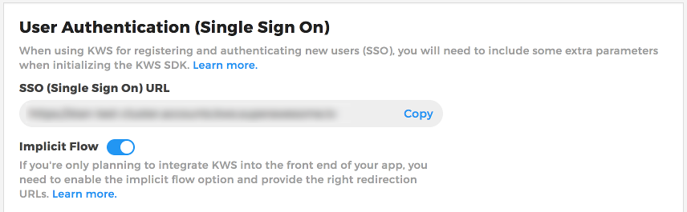
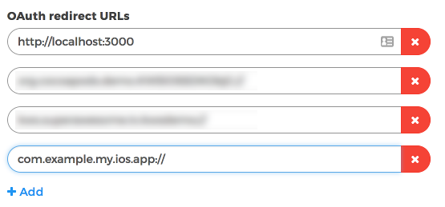
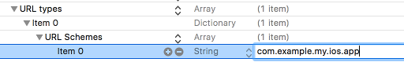

Creating and authenticating a user
==================================

There are two ways of creating or authenticating a user: using a KWS brandable view or using your own Native view.

KWS brandable view
^^^^^^^^^^^^^^^^^^

To be able to authenticate or create a user through a KWS brandable view you must follow the next steps:

Enable Implicit Flow in the Control Panel
-----------------------------------------

The first step is to enable Implicit Flow in your Kids Web Services Control Panel.

- Head over to the **Integration** section of your app
- Under the **User Authentication (Single Sign On)** section enable **Implicit Flow**

.. note:: Please take a note of the **SSO (Single Sign On) URL** because you will need it later.

Add OAuth redirect URLs
-----------------------

The second step, once you've enabled Implicit Flow, is to add **OAuth Redirect URLs** to the Control Panel.

Where **com.example.my.ios.app** is the Bundle Id of your iOS app.

Modify your Plist file
----------------------

The third step is to add the following keys to your Plist file:

This will allow your app to recognise and open certain URL schemes. 

Add your Bundle Id - in this example **com.example.my.ios.app** - as the desired URL scheme.

Call authentication method
--------------------------

Finally, once the prerequisite steps have been completed you can call the SDK method that will initialise the authentication process.

To do so we'll use the **SSO (Single Sign On) URL** obtained from the Kids Web Services Control Panel earlier on.

For our example, that should be something like **https://my.cluster.accounts.kws.superawesome.tv/**.

The **service protocol** for this is the **SingleSignOnServiceProtocol** and the functionality to use is the:

  * **signOn**

This function will take: 

============== ============== ========
Field          Type           Meaning
============== ============== ========
url            String         The base URL String for the SSO flow
parent         ViewController The current View Controller instance
============== ============== ========

.. code-block:: swift
  
  let myEnvironment = MyEnvironment()
  let sdk = ComplianceSDK(withEnvironment: myEnvironment!)
  
  let singleSignOnService = sdk.getService(withType: SingleSignOnServiceProtocol.self)

  singleSignOnService?.signOn(url: "https://my.cluster.accounts.kws.superawesome.tv/", parent: self) { (result, error) in

    if result != nil {
      //Success! We have a valid user
    } else {
      //Uh-oh! It seems there's an error...
    }
  }

The callback will pass the following values on completion:

============== ======================== =========
Value           Type                     Meaning
============== ======================== =========
result          LoggedUserModelProtocol  If non-null, the SDK was able to authenticate the user
error           Error                    If non-null, an error occurred
============== ======================== =========

The **LoggedUserModelProtocol** parameter will have the following values:

============== ======== =========
Field           Type    Meaning
============== ======== =========
token          String   The valid session token of the user
id             Integer  The identifier of the user (when creating a user)
============== ======== =========

Native view
^^^^^^^^^^^

To be able to authenticate and create a user using your own native views, you can use the following methods:

Creating a user
---------------

If there are no valid users, you can create a new one by using the **service protocol** named **AuthServiceProtocol** and the method to call is:
  
  * **createUser**

And it will take:

============== ======== ========
Field          Type     Meaning
============== ======== ========
username       String   The desired username for the new user
password       String   The desired password for the new user
timeZone       String   The time zone - **ALWAYS** null
dateOfBirth    String   The date of birth for the new user
country        String   The country code for the new user
parentEmail    String   The parent email of the new user
============== ======== ========

As such:

.. code-block:: swift

  //'timeZone' is a value that the KWS API will not support at the moment, needs to be set as null

  let myEnvironment = MyEnvironment()
  let sdk = ComplianceSDK(withEnvironment: myEnvironment!)
  let authService = sdk.getService(withType: AuthServiceProtocol.self)

  authService?.createUser(username: "username", password: "password", timeZone: nil, dateOfBirth: "2012-02-02", country: "US", parentEmail: "parent@test.com") { (result, error) in

    if result != nil {
      //Success! We have a valid user
    } else {
      //Uh-oh! It seems there's an error...
    }
  }

The callback will pass the following values on completion:

============== ======================== ========
Value           Type                     Meaning
============== ======================== ========
result          LoggedUserModelProtocol  If non-null, the SDK was able to create an authenticate the user
error           Error                    If non-null, an error occurred
============== ======================== ========

The **LoggedUserModelProtocol** parameter will have the following values:

============== ======= =========
Field           Type    Meaning
============== ======= =========
token          String   The valid session token of the user
id             Int      The identifier of the user
============== ======= =========

From here on you'll be able to check leaderboards, assign points, enable remote notifications, set app data, etc.

Login user
----------

To login as a user programmatically, you need to use the **service protocol** named **AuthServiceProtocol** and the method to call is:

  * **loginUser**

And it will take:

============== ======== ========
Field          Type     Meaning
============== ======== ========
username       String   The user's username
password       String   The user's password 
============== ======== ========

As such:

.. code-block :: swift

  let myEnvironment = MyEnvironment()
  let sdk = ComplianceSDK(withEnvironment: myEnvironment!)
  let authService = sdk.getService(withType: AuthServiceProtocol.self)

  authService?.loginUser(userName: "username", password: "password") { (result, error) in

    if result != nil {
      //Success! We have a valid user
    } else {
      //Uh-oh! It seems there's an error...
    }
  }

The callback will pass the following values on completion:

============== ======================== ========
Value           Type                    Meaning
============== ======================== ========
result          LoggedUserModelProtocol If non-null, the SDK was able to authenticate the user
error           Error                   If non-null, an error occurred
============== ======================== ========

The **LoggedUserModelProtocol** parameter will have the following values:

============== ======== ========
Field           Type    Meaning
============== ======== ========
token          String   The valid session token of the user
============== ======== ========

From here on you'll be able to check leaderboards, assign points, enable remote notifications, set app data, etc.

The authentication token
^^^^^^^^^^^^^^^^^^^^^^^^

The type of tokens used in the Kids Web Service are `JWT Tokens <https://jwt.io/introduction/>`_.

Next, we'll be describing how to read data from the retrieved token and how to handle a session with the Kids Web Service SDK.
